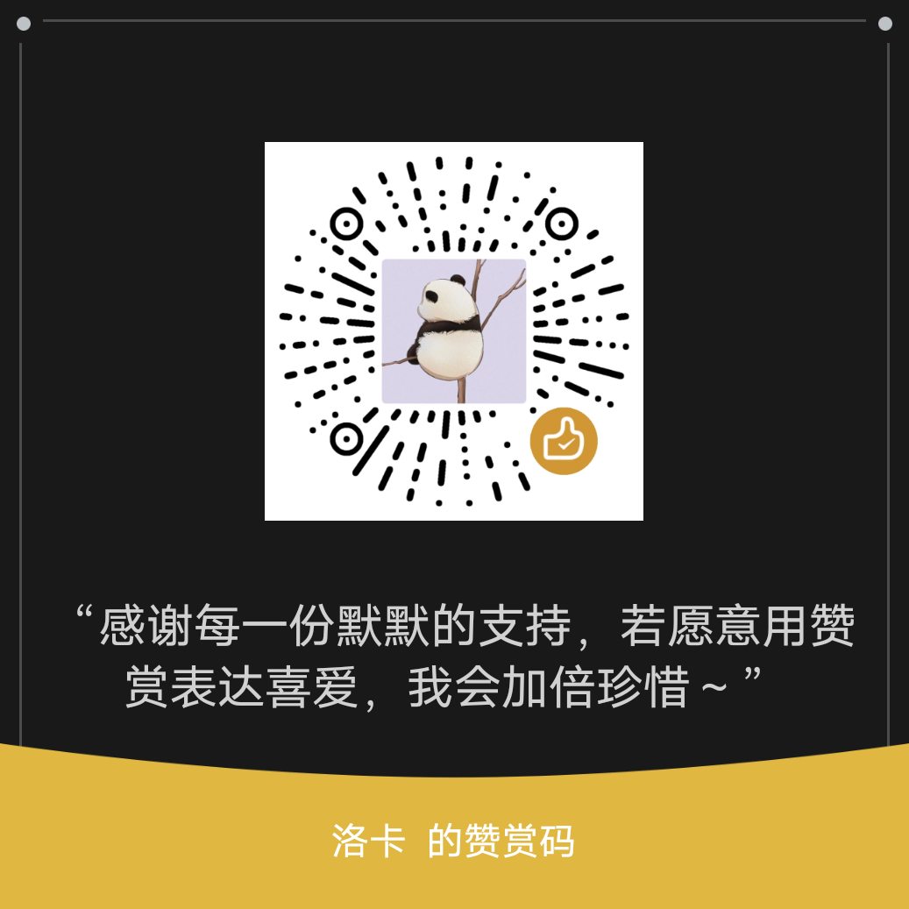

# ChatCAD

**基于 AI 对话的参数化 3D CAD 建模工具**

用自然语言描述模型，AI（Kimi）自动生成 JSCAD 代码，实时预览、调整参数、导出 3D 打印文件。

## 截图


## 特性

- **AI 驱动** — 登录 Kimi 后直接描述需求（如"做一个半径 30mm 高 60mm 的圆柱"），AI 生成对应 JSCAD 代码
- **三种生成模式** — ⚡快速（精简提示词快速验证）、⚖平衡（完整提示词+示例，日常推荐）、🎯精准（双阶段管线：先分析规格再生成，适合复杂模型）
- **对话历史** — 保留最近 10 轮对话上下文，AI 理解连续需求
- **实时 3D 预览** — Three.js 渲染，四种视图模式：实体 / 线框 / 混合 / 顶点
- **参数化调节** — 代码中的数值自动识别为滑块参数，拖拽即改
- **代码编辑器** — 集成 Monaco Editor，支持手写 / 修改 JSCAD 代码
- **自动修复** — 渲染出错时 AI 自动分析错误并修复代码
- **导出格式** — STL / OBJ / DXF（3DFACE 实体）
- **本地保存** — 保存模型（含对话记录 + 代码 + 参数），保存后自动清空建新工程；从「我的模型」恢复完整状态
- **丰富 Sandbox API** — 支持 extrudeLinear/extrudeRotate/cone/stack/text3d 等 30+ 函数
- **中断生成** — 随时停止 AI 生成并恢复之前代码
- **WebWorker 加速** — JSCAD 渲染优先在 WebWorker 执行，超时自动回退主进程
- **跨平台** — 基于 Electron，支持 Windows / macOS / Linux

## 技术栈

| 层 | 技术 |
|---|---|
| 框架 | Electron + Electron-Vite |
| 前端 | Vue 3 + TypeScript |
| 3D 渲染 | Three.js (WebGL) |
| 几何内核 | JSCAD (@jscad/modeling) |
| 代码编辑器 | Monaco Editor |
| AI 接口 | Kimi 网页 API（流式 / 非流式） |
| 打包 | electron-builder (NSIS / DMG / AppImage) |

## 快速开始

```bash
# 安装依赖
npm install

# 启动开发模式
npm run dev

# 构建生产版本
npm run build

# 打包分发（自动签名需证书）
npx electron-builder --win --x64
```

## 使用流程

1. 启动应用后，点击右上角 **「登录 Kimi」** 按钮，在打开的浏览器窗口中完成 Kimi 登录
2. 在左侧聊天面板输入模型描述，选择生成模式（快速 / 平衡 / 精准），例如：*"做一个长 100mm 宽 60mm 高 30mm 的收纳盒，壁厚 2mm"*
3. AI 生成 JSCAD 代码（流式输出到代码编辑器）并自动渲染 3D 预览
4. 通过右侧滑块微调参数，拖拽即时更新模型
5. 在预览区切换视图模式（实体 / 线框 / 混合 / 顶点）检查模型
6. 满意后点击 **导出** 选择 STL / OBJ / DXF 格式；点击 **保存** 将模型（含对话记录）存入本地，保存后自动新建空白工程
7. 点击 **我的模型** 浏览已有模型，加载后恢复完整的代码 + 对话 + 参数状态

> **快捷键：** Enter 发送消息 · Ctrl+Enter / Cmd+Enter 也可发送 · Shift+Enter 换行 · 生成中点击停止按钮中断

## 项目结构

```
src/
├── main/               # Electron 主进程
│   ├── index.ts        # 入口
│   ├── ipc.ts          # IPC 通道注册
│   ├── jscad-runner.ts # JSCAD 运行时 + STL/OBJ/DXF 导出
│   ├── kimi-api.ts     # Kimi 流式/非流式 API（支持 AbortSignal）
│   ├── kimi-login.ts   # Kimi 登录窗口
│   └── store.ts        # 本地存储 (electron-store)
├── preload/            # preload 脚本（桥接 API）
└── renderer/           # Vue 3 前端
    ├── App.vue         # 主界面（状态管理、AI 对话、自动修复、3D 渲染）
    ├── components/     # UI 组件
    │   ├── ChatPanel.vue      # 对话面板
    │   ├── CodeEditor.vue     # Monaco 代码编辑器
    │   ├── ModelViewer.vue    # Three.js 3D 预览
    │   ├── ParamsPanel.vue    # 参数滑块面板
    │   ├── Toolbar.vue        # 全局工具栏（登录/模板/IO）
    │   └── LoginDialog.vue    # Kimi 登录弹窗
    ├── utils/          # 工具函数
    │   └── params.ts   # 参数解析（从代码中提取变量定义）
    └── jscad.worker.ts # JSCAD WebWorker
```

## 支持作者

如果这个项目对你有帮助，欢迎赞赏支持 ❤️

| 微信赞赏 | 联系作者 |
|---|---|
|  | 微信：**luoka328** |

## 许可证

MIT
